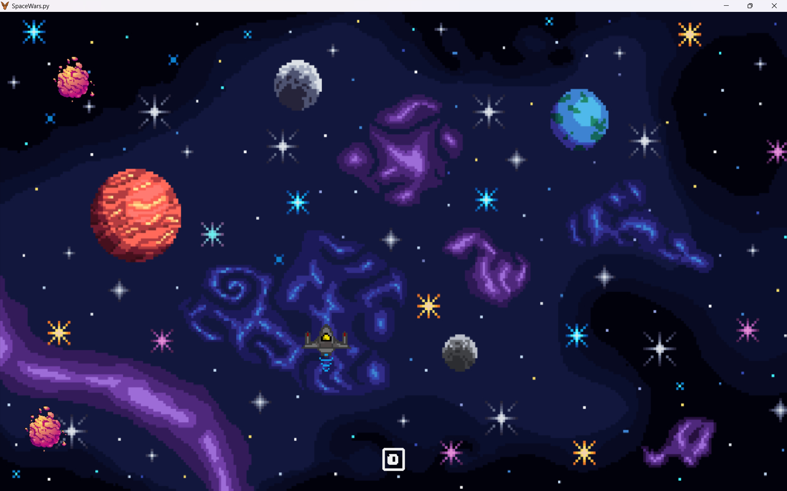

# SpaceWars.py 🚀

Welcome to **SpaceWars.py**, an exciting 2D arcade-style game where you pilot a spaceship, destroy asteroids, and survive as long as you can! Built using the **PyGame** framework, this project is a simple yet thrilling journey through space with a fun gameplay loop and dynamic elements.

---

## 🎮 Features

- **Fast-Paced Gameplay**: Control a spaceship to evade and destroy falling asteroids.
- **Laser Action**: Fire lasers to destroy asteroids and rack up your score.
- **Dynamic Movement**: Smooth movement with acceleration for fast-paced action.
- **Score Tracking**: Keep track of your progress with an in-game score display.
- **Custom Sprites**: Beautiful pixel art for the ship, asteroids, lasers, and backgrounds.

---

## 🖼️ Game Preview



---

## 🛠️ How to Play

1. **Controls**:
   - **W/A/S/D**: Move the spaceship up, left, down, and right.
   - **Left Mouse Button**: Fire lasers to destroy asteroids.
   - **Shift**: Speed boost for quick dodging.

2. **Goal**:
   - Destroy as many asteroids as possible to increase your score.
   - Avoid getting hit by asteroids, or the game will end!

---

## 🚀 Installation & Setup

1. **Clone the Repository**:
   ```bash
   git clone https://github.com/yourusername/SpaceWars.py.git
   cd SpaceWars.py
   ```

2. **Install Dependencies**:
   Make sure you have Python installed. Then install the required libraries:
   ```bash
   pip install pygame
   ```

3. **Run the Game**:
   ```bash
   python SpaceWars.py
   ```

---

## 📂 Project Structure

```
SpaceWars.py/
|├── assets/           # Contains all the game assets (images, icons, etc.)
|├── font/             # Custom font for the score display
|├── SpaceWars.py     # Main game script
|└── README.md        # This file!
```

---

## 🎨 Assets Used

- Spaceship and asteroid sprites: Custom-designed pixel art.
- Background: Handcrafted to give a cosmic vibe.
- Font: Retro-style pixel font for score display.

---

## 🌟 Key Highlights

- **Resizable Window**: The game dynamically adjusts the background and gameplay to fit any window size.
- **Boundary Constraints**: The spaceship stays within the screen bounds at all times.
- **Custom Events**: Asteroids spawn at random intervals for dynamic gameplay.

---

## 📖 Learning Outcomes

This project demonstrates:

- Game development with the PyGame framework.
- Sprite-based collision detection using masks.
- Dynamic window resizing and element scaling.
- Event-driven programming in Python.

---

## 🎉 Acknowledgments

- Special thanks to the PyGame community for their amazing resources and tutorials.
- Inspired by classic 2D arcade space games.

---

Enjoy playing **SpaceWars.py**! 🚀✨

